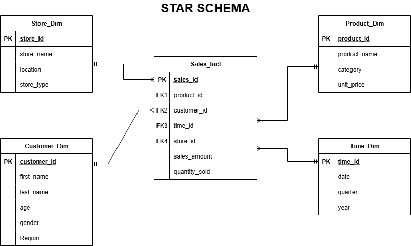
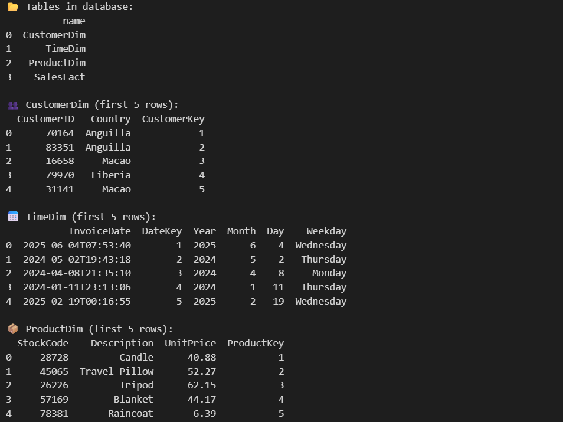
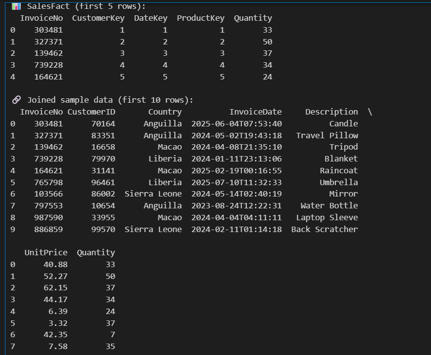
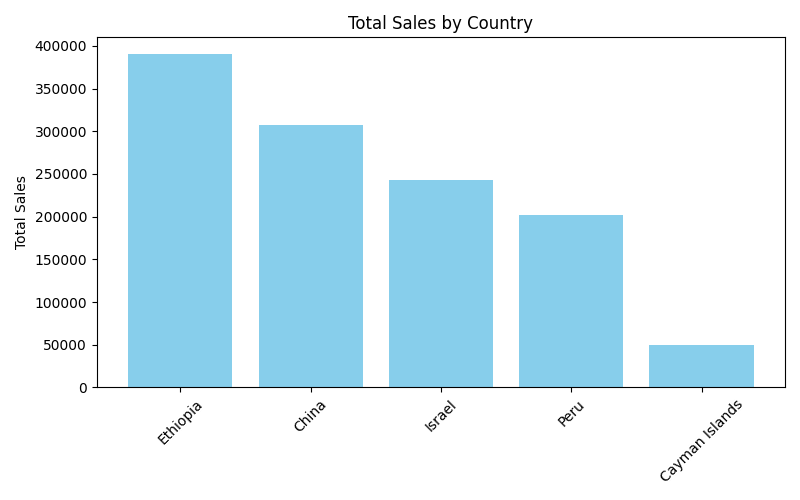
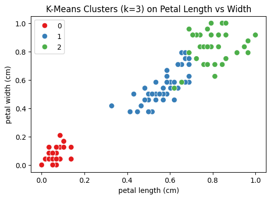
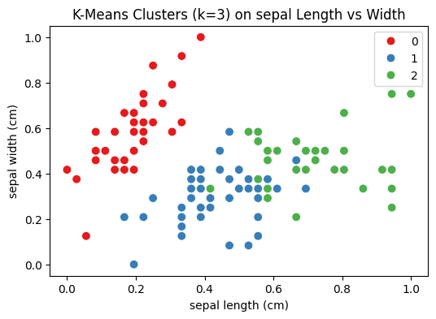
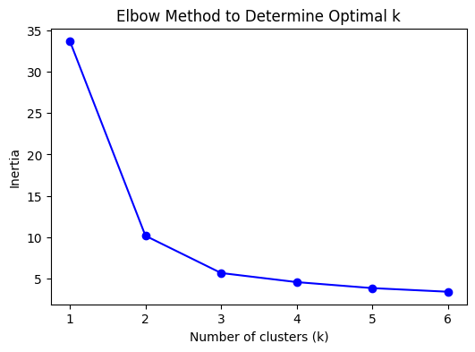

# **Data Warehousing & Mining Project Summary**
This project demonstrates the end-to-end process of data warehousing and mining using the Iris dataset, a synthetic retail dataset and a synthetic transactions data set. The workflow covers data preprocessing, clustering, classification, association rule mining, and ETL (Extract, Transform, Load) for a retail data warehouse.
- All data sets can be found in the [data](data) folder
- All images can be found in the [images](images) folder
- This project provides a practical demonstration of data preparation, mining, and warehousing techniques suitable for real world applications.

# Section 1: Data Warehousing
## TASK 1

### *Explain why you chose star schema over snowflake*
- I chose a star schema because it is simpler and faster for analytical queries, requiring fewer joins compared to a snowflake schema. Its denormalized structure makes it easier for business users and BI tools to understand, improving usability for reporting and dashboards. Also, the star schema’s design is optimized for aggregations and OLAP operations, which are common in retail analytics


The  SQL script [table_creation.sql](table_creation) defines the schema for a star-schema retail data warehouse, including dimension and fact tables.

## Tables Defined

### Dimension Tables

- **Product_Dim**
  - `product_id`: Primary key, unique product identifier
  - `product_name`: Name of the product
  - `category`: Product category
  - `unit_price`: Price per unit

- **Customer_Dim**
  - `customer_id`: Primary key, unique customer identifier
  - `first_name`, `last_name`: Customer's name
  - `gender`: Gender of the customer
  - `age`: Age of the customer
  - `region`: Customer's region

- **Store_Dim**
  - `store_id`: Primary key, unique store identifier
  - `store_name`: Name of the store
  - `location`: Store location
  - `store_type`: Type of store

- **Time_Dim**
  - `time_id`: Primary key, unique time identifier
  - `date`: Date of transaction
    - `quarter`: Quarter of the year
  - `year`: Year

### Fact Table

- **Sales_Fact**
  - `sale_id`: Primary key, unique sale identifier
  - `product_id`: Foreign key to Product_Dim
  - `customer_id`: Foreign key to Customer_Dim
  - `time_id`: Foreign key to Time_Dim
  - `store_id`: Foreign key to Store_Dim
  - `sales_amount`: Total sales amount
  - `quantity_sold`: Quantity sold
-  **View of the retail warehouse**
 


## Usage

- Run this script in your SQL database (e.g., SQLite, PostgreSQL, MySQL) to create the necessary tables for your retail data warehouse.


## Task 2 : ETL Process Implementation
The notebook [etl_retail.ipynb](etl_retail.ipynb) demonstrates a full ETL (Extract, Transform, Load) pipeline for a synthetic retail dataset, including data generation, cleaning, transformation, aggregation, and loading into a SQLite data warehouse.

## Contents

- **Data Extraction**
  - Generates a synthetic retail dataset using the `Faker` library.
  - Simulates 1,000 transactions with random customers, products, quantities, prices, and countries.
  - Ensures each product appears at least once and introduces occasional negative values for data cleaning demonstration.

- **Data Exploration**
  - Displays summary statistics and sample records.
  - Checks for negative quantities and prices.

- **Data Transformation**
- Removes rows with negative quantities or unit prices.
  - Adds a `TotalSales` column (Quantity × UnitPrice).
  - Aggregates total sales by country, product, and customer.
  - Filters records for the last year.

- **Data Loading**
  - Creates dimension tables: Customer, Time, Product.
  - Creates a Sales Fact table with surrogate keys.
  - Loads all tables into a SQLite database (`retail_dw.db`).
  - Previews the loaded tables.

- **Export**
  - Saves the cleaned retail data as `data/cleaned_retail_data.csv`.


## Task 3: OLAP Queries and Analysis

### OLAP Analysis – Retail Data Warehouse

The files [olap_analysis.ipynb](olap_analysis.ipynb) and [olap_queries.sql](olap_queries.sql)  demonstrates OLAP (Online Analytical Processing) on a synthetic retail data warehouse built in SQLite using a star schema.

#### Files Included

1. **`olap_queries.sql`**
   - Contains SQL queries for OLAP-style analysis, including:
     - **Roll-up**: Aggregating total sales by country and quarter.
     - **Drill-down**: Monthly sales breakdown for a specific country.
     - **Slice**: Filtering sales for a specific product category (e.g., Electronics).

2. **`olap_analysis.py`**
   - Python script that connects to `retail_dw.db`, executes the OLAP queries, and displays the results directly in the console.
   - Includes one visualization example (bar chart of sales by country) using **matplotlib**.

#### Usage

1. Ensure `retail_dw.db` exists and contains the star schema tables (`CustomerDim`, `TimeDim`, `ProductDim`, `SalesFact`).
2. Run the SQL queries in **`olap_queries.sql`** using any SQLite-compatible tool, or execute them through **`olap_analysis.py`**.
3. The Python script will print query results and display the visualization.


### **Sales Analysis Report**

- The sales analysis from our OLAP query reveals that Ethiopia recorded the highest total sales, reaching nearly 390,000 units, followed by China with approximately 310,000 units. Israel, Peru, and the Cayman Islands show progressively lower sales figures, with the Cayman Islands contributing less than 50,000 units in total sales. 
   - This distribution indicates that a small number of countries dominate overall revenue, suggesting strong market presence or higher customer demand in those regions.
- The visual pattern highlights a significant sales gap between the top two markets (Ethiopia and China) and the rest. Such insights are valuable for targeting marketing strategies, resource allocation, and future sales expansion plans. 
   - For example, strengthening operations in Ethiopia could further enhance profitability 
   - Investigating the low performance in the Cayman Islands could reveal opportunities for market growth or point to structural challenges such as limited demand or distribution constraints.
- The data warehouse played a crucial role in enabling this analysis by integrating and organizing data into fact and dimension tables. This structure allowed for efficient OLAP operations such as roll-up and slice, making it possible to quickly compare countries and extract meaningful insights. It supports decision-making by providing clean, consistent, and query-ready data, reducing the time analysts spend on data preparation.
- It is important to note that the dataset used for this analysis is synthetic. While it was designed to mimic realistic retail patterns, it may not perfectly reflect actual market conditions. As such, the results should be interpreted as indicative trends rather than definitive business intelligence, with real-world validation required before making strategic decisions.

# SECTION 2 : Data Mining
## Task 1: Data Preprocessing and Exploration
### Iris Dataset Preprocessing

The notebook  [preprocessing_iris.ipynb](preprocessing_iris.ipynb) covers the full preprocessing pipeline for the Iris dataset, preparing it for machine learning tasks such as classification and clustering.
- 0 → Setosa  
- 1 → Versicolor  
- 2 → Virginica

#### Contents

- **Data Loading**
  - Loads the Iris dataset using scikit-learn.
  - Converts it into a pandas DataFrame and adds species labels.

- **Data Exploration**
  - Checks for missing values.
  - Generates summary statistics.
  - Visualizes feature relationships with pair plots.
  - Displays a correlation heatmap.
  - Uses boxplots to detect outliers by species.

- **Data Preparation**
  - Separates features and target variable.
  - Splits the data into training and test sets (80/20 split, stratified by species).

- **Feature Scaling**
  - Applies MinMax scaling to numeric features after splitting to prevent data leakage.

- **Label Encoding**
  - Encodes the species labels as integers for machine learning compatibility.

- **Saving Processed Data**
  - Saves the scaled features and encoded labels for both train and test sets as CSV files in the `data/` directory:
    - `X_train.csv`
    - `X_test.csv`
    - `y_train.csv`
    - `y_test.csv`
- **Usage**
   - Run the notebook in Jupyter or VS Code.
   - Follow the output and visualizations for each preprocessing step.


## TASK 2: : Clustering
The notebook  [clustering_iris.ipynb](clustering_iris.ipynb) demonstrates unsupervised clustering on the Iris dataset using K-Means, and compares the resulting clusters to the true species labels.

## Contents

- **Data Loading**
  - Loads preprocessed Iris data (`X_train.csv`, `X_test.csv`, `y_train.csv`, `y_test.csv` from the `data/` directory).

- **K-Means Clustering**
  - Applies K-Means clustering with `k=3` (matching the number of Iris species).
  - Compares cluster assignments to true labels using the Adjusted Rand Index (ARI).

- **Elbow Method**
  - Uses the elbow method to determine the optimal number of clusters (`k`).
  - Plots inertia vs. `k` to visualize the "elbow" point.

- **Cluster Visualization**
  - Visualizes clusters on petal length vs. petal width and sepal length vs. sepal width using Seaborn scatter plots.

- **Analysis**
  - Discusses the meaning of ARI and the optimal number of clusters.
  - Notes on cluster overlap between species.


### CLUSTERING REPORT
    
- The K-Means clustering with **k=3** achieved an **Adjusted Rand Index (ARI) of \~0.73**, indicating strong alignment between predicted clusters and the actual Iris species.
- Visual inspection and statistical results show that **setosa** forms a distinctly separate cluster, reflecting its unique petal and sepal measurements. However, **versicolor** and **virginica** display partial overlap, leading to most of the observed misclassifications. This overlap is expected, as their measurements in certain dimensions (especially sepal length and width) are similar, making them harder to distinguish without more advanced techniques. 


The elbow method confirms **k=3** as the optimal choice, balancing cluster compactness and simplicity.
- In real-world scenarios, such clustering can be applied to **customer segmentation**, where natural groupings emerge based on purchasing behavior, demographics, or preferences. By identifying clusters, businesses can tailor marketing strategies, product recommendations, and customer experiences. Similarly, in scientific research, clustering supports species classification, anomaly detection, and pattern discovery when labeled data is limited or unavailable, making it a valuable exploratory tool across industries.


## Task 3: Classification and Association Rule Mining 

The notebook [mining_iris_basket.ipynb](mining_iris_basket.ipynb) demonstrates two key data mining tasks: **classification** using the Iris dataset and **association rule mining** on synthetic retail basket data.

## Contents

- **Part A: Classification**
  - Loads preprocessed Iris data (`X_train.csv`, `X_test.csv`, `y_train.csv`, `y_test.csv` from [data/](data/))
  - Trains and evaluates a Decision Tree and K-Nearest Neighbors (KNN) classifier
  - Reports accuracy, precision, recall, F1-score, and displays a classification report
  - Visualizes the trained decision tree
  - Compares classifier performance

- **Part B: Association Rule Mining**
  - Generates synthetic retail basket transactions
  - Encodes transactions for analysis
  - Applies the Apriori algorithm to find frequent itemsets
  - Extracts and displays the top 5 association rules by lift
  - Analyzes and interprets one strong rule
  - Saves the generated transactions to [data/synthetic_transactions.csv](data/synthetic_transactions.csv)


## Technologies Used

- Python (pandas, scikit-learn, matplotlib, seaborn, mlxtend, faker, sqlite3)
- Jupyter Notebooks / VS Code

# General Usage Guide

This project is organized into several notebooks and scripts, each focusing on a specific aspect of data warehousing and mining. Run individual files and scripts for results


## 1. **Set Up the Environment**

- Ensure you have Python 3.x installed.
- Install required packages:
  ```sh
  pip install pandas scikit-learn matplotlib seaborn mlxtend faker 


